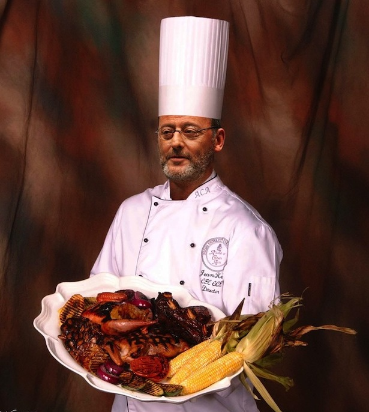

!SLIDE content transition=cover

# Provisioning

>


!SLIDE title-and-content incremental transition=cover

# Use Cases

* Provide **clean clone of production environment**. You can guarantee that your staging server is a exact clone of
your production server.

* **Team of developers working along the globe and on different platforms**. The idea is to do development against
unified, easy to replicate virtual platform with same characteristics for all developers.

* **Configure new workstation for new employee**, e.g. macbook configuration (rvm, ruby, mysql, postgesql, skype, iterm2 etc.)


!SLIDE title-and-content incremental transition=zoom

# Available options for provisioning

* Create simple shell script
* Use chef gem
* Use puppet gem (out of scope)
* Provisioning from Github: [Boxen](http://boxen.github.com/) - tool for automating and managing Macs with Puppet


!SLIDE content transition=cover

# Chef

>




!SLIDE title-and-content transition=cover incremental

# Chef - what is it?

> Chef is like unit tests for your servers

>[Ezra Zygmuntowicz](http://www.linkedin.com/in/ezraz)


* It is **domain specific language** based on ruby.

* You can write **installation scripts** that will install all required for your platform packages (like homebrew or macport).

* Could be executed **locally** or on **remote** server.


!SLIDE title-and-content incremental transition=cover

# Types of Chef components

* **Chef Server** - used to distribute cookbooks, manage and authenticate nodes and query
infrastructure information on multiple nodes.
* **Chef Client** - command line tool for interacting with Chef Server.
* **Chef Solo** - you can run cookbooks in the absence of a Chef Server on single node.
You need to have cookbooks somewhere. <span style="color:red">Only Chef Solo will be used in this presentation</span>.


!SLIDE title-and-content transition=cover

# Common conceps of Chef

* **Node** - A host where the Chef client will be executed.

* **Recipe** - ruby program with code to install or configure software
(install webserver or database, create database user etc.).

```ruby
# cookbooks/application/default.rb

include_recipe "rvm" # include another recipe

package "rvm" # include OS package

bash "ls -al" # run OS command
```


!SLIDE title-and-content transition=cover

# Common concepts of Chef (continued)

* **Cookbook** - a collection of recipes (e.g. db cookbook could handle common interface for
installing/configuring mysql and postgresql).

```
  -cookbooks
    -application
      -attributes
        default.rb
      -recipes
        default.rb
        my_postgres.rb
        my_mysql.rb
      -templates
        Gemfile.erb
        mysql_database.yml.erb
```


!SLIDE title-and-content transition=cover

# Common concepts of Chef (continued)

* **Attribute** - default values to be used by cookbook in order to configure it (e.g. required
version, service port or user name/password etc.). They can be redefined when you configure recipe.

* **Data Bags** - collection of properties that can be used together.

* **Metadata** - describes the recipes, dependencies, supported platforms, etc.


!SLIDE title-and-content transition=cover

# Common concepts of Chef (continued)

* **Resource** - it could be file, directory, package, service etc.

```ruby
  directory "/var/cache/local/preseeding" do
    owner "root"
    group node['mysql']['root_group']
    mode 0755
    recursive true
  end
  service "mysql" do
    action :start
  end
  dmg_package "GitOSX-Installer" do
    type "pkg"
    action :install
  end
  cron "noop" do
    hour "5"
    minute "0"
    command "/bin/true"
  end
```


!SLIDE title-and-content transition=cover

# Common concepts of Chef (continued)

* **Template** - powered by ERB and used for generation configuration files.

```ruby
template "#{node[:rails][:app_root]}/Gemfile" do
  source "Gemfile.erb"
  mode "0666"
  owner node[:rails][:user]
  group node[:rails][:group]
  variables({ :db_gem => "mysql" })
  not_if { `ls #{node[:rails][:app_root]}`.include?("Gemfile") }
end
```

* **Role** - reusable configuration for multiple nodes (mac user role, web role, database role, etc).

* **Run List** - list of recipes and roles to run.


!SLIDE title-and-content transition=cover

# Running

* You create **recipes run list** in order to run provision.

```yml
{
  "run_list": [ "recipe[application]" ]
}
```

* Chef runs a bunch of recipes to set up your server.

* You can run it with vagrant:

```bash
vagrant provision
vagrant reload
vagrant up
```

* or with chef-solo:

```bash
chef-solo -c your-solo-config-location.rb
          -j your-solo-node-location.json
```


!SLIDE title-and-content transition=cover

# Example of configuration file

```ruby
project_root = File.dirname(File.expand_path(__FILE__))

cookbook_path [File.join(project_root, "..", "cookbooks"),
               File.join(project_root, "..", "vendored_cookbooks")]

#json_attribs File.join(project_root, "..", "nodes",
#   "vagrant-node.json")
```


!SLIDE title-and-content transition=cover

# Example of vagrant-node.json file

```json
{
  "run_list": [ "recipe[application]" ],

  "application": { "app_name": "triton" },

  "rvm": {"ruby": {"version": "1.9.3",
                   "implementation": "ruby",
                   "patch_level": "p392"}},

  "postgresql": { "username": "postgres", "password": "postgres"},

  "mysql": { "server_debian_password": "root",
             "server_root_password": "root",
             "server_repl_password": "root"}
}
```


!SLIDE title-and-content transition=cover

# Chef-Solo: Standalone Installation

* If you want to use chef apart from vagrant, you have to install chef gem:

```bash
gem install chef
```

* and then use it:

```bash
ssh user@your_server
cd
sudo chef-solo -c /vagrant/config/solo.rb -c /vagrant/nodes/node.rb
```

* <div style="color:red">Important: do it from user home.</div>


!SLIDE title-and-content transition=cover

# Common recipes

* Public cookbooks are located at [opscode community home](http://community.opscode.com/cookbooks)

* For easy manipulation with common recipes, install **librarian-chef** gem:

```bash
gem install librarian-chef
```

* Initialize librarian-chef. New **Cheffile** file will be created:

```bash
librarian-chef init
```

* Install cookbooks defined in Cheffile:

```bash
librarian-chef install --path vendored_cookbooks
```

* We keep them separately from our cookbooks. Our cookbooks are located in **cookbooks** folder.


!SLIDE title-and-content transition=cover

# Example of Cheffile

```ruby
site 'http://community.opscode.com/api/v1'

cookbook 'apt'
cookbook 'git'

cookbook 'mysql'
cookbook 'postgresql'
```

* Other useful commands:

```bash
librarian-chef outdated
librarian-chef update
```


!SLIDE title-and-content transition=cover

# Tip 1: Skipping consecutive runs

* If you run it several times, Chef can skip all consecutive runs, thanks to **not_if** method call:

```ruby
app_user = 'app_user'
postgres_user = 'postgres'
db_schema = 'myapp_dev'

bash "Creating postgres db user" do
  user "postgres"

  code <<-CODE
    psql -c "CREATE USER #{app_user} WITH PASSWORD '#{app_user}'"
  CODE

  not_if { `sudo sudo -u #{postgres_user} psql -c '\\l'`.
    include?(db_schema) }
end
```


!SLIDE title-and-content transition=cover

# Tip 2: Support for multiple platforms

* You can to different actions for different patforms if you want:

```ruby
# cookbooks/some_recipe/recipes/default.rb

case node[:platform]
  when "ubuntu"
    package "package_for_ubuntu"
  when "centos"
    package "package_for_centos"
  when "mac_os_x"
    package "package_for_mac_os_x"
end
```


!SLIDE title-and-content transition=cover

# Tip 3: Integration with Capistrano

* Capistrano **Capfile** script

```ruby
set :application, "vagrant"
set :host, "22.22.22.22"
set :user, "vagrant"
set :password, "vagrant"
role :vagrant, host

namespace :vagrant do

  desc "Execute chef run_list"
  task :run_list, :roles => :vagrant do
    cmd = "/opt/vagrant_ruby/bin/chef-solo -c /vagrant/config/solo.rb
    -j /vagrant/nodes/vagrant-node.json"

    run %[sudo #{cmd}]
  end
end
```

* Now you can run this task:

```bash
  cap vagrant:run_list
```
